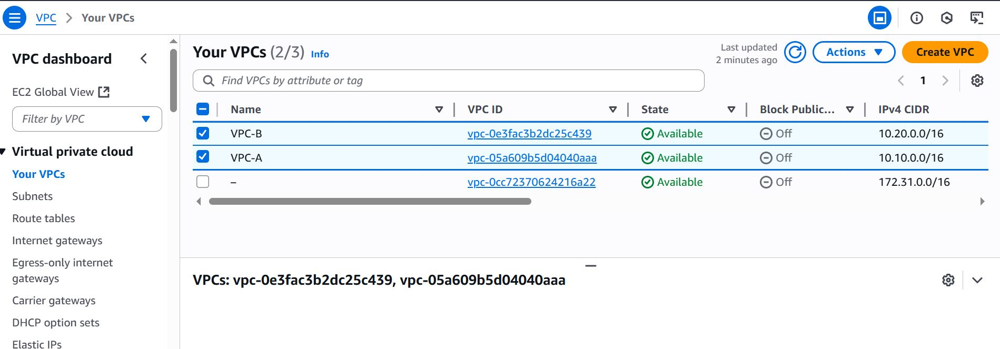

# Multi-VPC Peering in AWS
This project demonstrates a basic but production-relevant cloud networking pattern: connecting two VPCs using AWS VPC peering.

## Use Case
As a Data & BI Specialist, I am building foundational cloud infrastructure skills to support more complex data architectures. This lab simulates a scenario where two isolated VPCs, such as those used for staging and analytics environments, need to communicate privately within AWS. 
Although I have not yet implemented cross-VPC data transfers in a production environment, this hands-on project helps me prepare for real-world use cases like:
- Connecting a data ingestion environment to an analytics VPC
- Enabling secure communication between a data warehouse and ETL jobs across VPCs
- Supporting multi-team or multi-region data pipelines

This setup demonstrates how private communication between VPCs can be established using AWS VPC Peering without internet exposure, which is a key building block in secure, scalable data infrastructure.

## Architecture Overview
- **VPC-A**: `10.10.0.0/16`
  - Public Subnet: `10.10.1.0/24`
  - Private Subnet: `10.10.2.0/24`
- **VPC-B**: `10.20.0.0/16`
  - Public Subnet: `10.20.1.0/24`
  - Private Subnet: `10.20.2.0/24`

**Public & Private Subnets**: Public and private subnets created in both VPC-A and VPC-B

- **Peering Connection**: Between VPC-A and VPC-B
- No internet gateways or NAT gateways (internal traffic only)

## Route Table Configuration
Each of the four route tables was updated to include a route pointing to the **peer VPC’s CIDR block** through the **VPC peering connection**.
You can view the detailed route tables by clicking the links below:
- [VPC-A Private Route Table](./Screenshots/VPC-A-Private-RT.JPG)
- [VPC-A Public Route Table](./Screenshots/VPC-A-Public-RT.JPG)
- [VPC-B Private Route Table](./Screenshots/VPC-B-Private-RT.JPG)
- [VPC-B Public Route Table](./Screenshots/VPC-B-Public-RT.JPG)

## Skills Demonstrated
- AWS VPC configuration
- Subnet design (public/private separation)
- VPC Peering setup and route table management
- Foundation for cross-VPC analytics pipelines or ETL jobs

 _“Understanding cloud networking is critical to building a reliable data infrastructure.”_

 ---

## Connect with Me

 [View my LinkedIn profile](https://www.linkedin.com/in/winnie-madikizella-data/)

I'm always open to collaboration, mentorship, and new opportunities in data analytics, BI, and cloud infrastructure.

